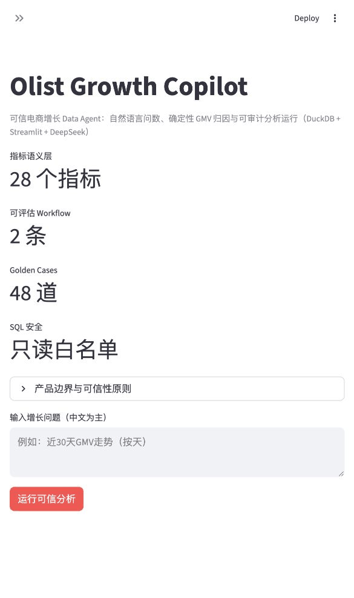
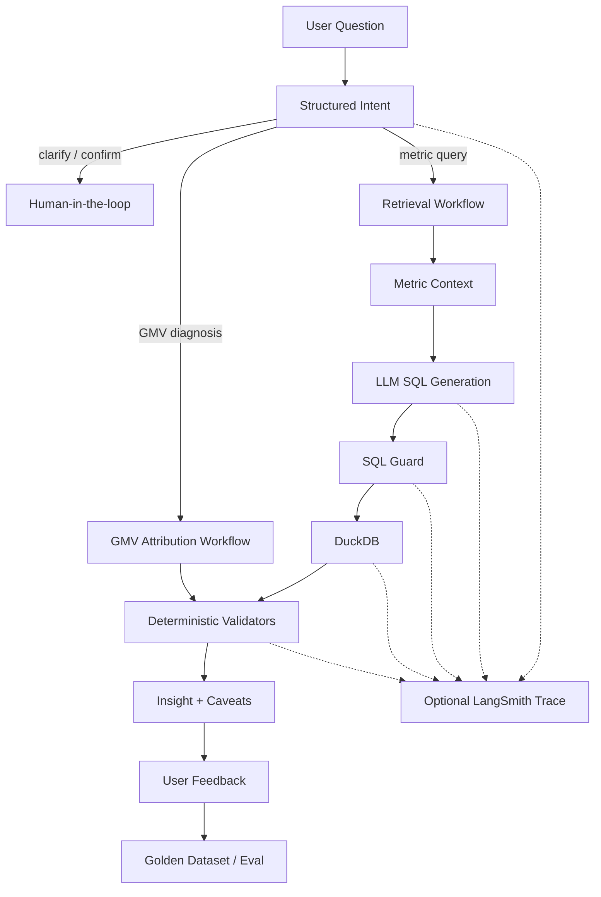

# Olist Growth Copilot

> 一个面向电商增长分析的可信 Data Agent：把自然语言问题转化为可审计的分析运行，并通过指标语义、确定性校验、Golden Set 与可选 LangSmith Trace 建立“验算闭环”。

**技术栈**：Streamlit · DuckDB · DeepSeek / OpenAI · Python 3.11 · LangSmith（可选）

[GitHub 仓库](https://github.com/stdnthe/growth-data-agent) · [90 秒演示脚本](docs/portfolio_demo.md) · [评测方法](docs/eval_methodology.md) · [最新评测快照](eval/results/README.md)



## 30 秒了解项目

| 面试官关心的问题 | 本项目给出的证据 |
| --- | --- |
| 不只是 NL2SQL 吗？ | 结构化意图、Workflow 路由、指标语义、结果校验与统一 `AnalysisRun` |
| 如何保证可信？ | 只读 SQL Guard、确定性 GMV 分解、比例/粒度/窗口/可加和校验 |
| 如何衡量效果？ | 40 道 SQL/结果 Golden Case、8 道意图 Case、端到端统一分母与 Bad Case |
| 如何持续迭代？ | 运行 Trace、失败阶段、用户反馈，经人工审核后进入 Golden Dataset |
| 产品边界是什么？ | 自动归因聚焦 GMV；缺少曝光、点击和广告成本时拒绝伪精确结论 |

## 产品定位

普通 NL2SQL Demo 通常只回答“SQL 能不能跑”。Growth Copilot 进一步记录和验证：

```text
用户问题
  ↓
结构化意图：任务、指标、时间、粒度、维度、歧义
  ↓
Workflow 路由：指标查询 / 确定性 GMV 归因
  ↓
指标语义 + SQL Guard + DuckDB 执行
  ↓
结果与归因校验
  ↓
洞察、假设、限制、运行元数据
  ↓
用户反馈 → 失败样本 → Golden Dataset → 回归评测
```

产品采用一个克制的边界：高频、路径明确的问题优先走可评估的 Workflow；开放式 Agent Loop 暂不承担缺少验算标准的任务。

## 当前能力

| 能力 | 当前实现 |
| --- | --- |
| 结构化意图 | 识别任务、一个或多个指标、时间范围、比较口径、粒度、维度、歧义与置信度 |
| Human-in-the-loop | 模糊指标请求主动澄清；超出当前归因边界时先确认 |
| 统一 AnalysisRun | 每次运行记录 `run_id`、Workflow、SQL、验证、版本、延迟、失败阶段与反馈 |
| Text-to-SQL | DeepSeek / OpenAI-compatible API；无 Key 时使用有限规则 fallback |
| SQL Guardrail | 只读、单语句、危险关键字拦截、表白名单、自动 LIMIT |
| 指标语义层 | `metrics.yml` 定义 28 个增长、订单、用户、履约和评价指标 |
| GMV 确定性归因 | `GMV = Orders × AOV`，并按州、品类、商家下钻贡献 |
| 结果验算器 | 非空、请求指标、有限数值、比例范围、时间粒度、归因可加和、窗口互斥 |
| 有限纠错 | LLM SQL 被 Guard、执行或结果校验拒绝时，最多携带确定性错误重试一次 |
| 可观测性 | 可选 LangSmith Trace；缺依赖、缺 Key 或发送失败均不阻塞主分析 |
| 反馈闭环 | UI 收集有用性与失败类型，本地写入 `.runtime/feedback.jsonl` |
| Eval v2 | 40 道 Golden SQL 全结果等价评测 + 8 道结构化意图评测 + 端到端统一分母 |

## 可信分析界面

每次回答由以下区域构成：

1. **分析计划与口径**：系统理解的任务、指标、时间范围、Workflow、假设。
2. **数据与洞察**：SQL、查询结果、图表或 GMV 贡献拆解。
3. **确定性校验**：逐项显示通过或失败，不展示模型隐藏思维链。
4. **运行元数据**：模型、Prompt/指标版本、延迟、重试、Trace 状态。
5. **用户反馈**：将负反馈沉淀为后续 Golden Set 候选。

推荐演示问题：

- `近30天GMV走势（按天）`：正常指标查询与结果校验。
- `为什么最近GMV下降？`：默认最近 30 天，执行确定性归因。
- `最近销售表现怎么样？`：缺少指标，主动澄清。
- `为什么准时送达率下降？`：提示当前自动归因只支持 GMV，并请求确认。

完整讲解顺序和每一步的面试要点见 [90 秒演示脚本](docs/portfolio_demo.md)。

## 架构



核心模块：

```text
growth-analysis-agent/
├── app.py                         # Streamlit 产品界面，仅负责配置与展示
├── agent/
│   ├── models.py                  # AnalysisIntent / AnalysisRun / ValidationResult
│   ├── pipeline.py                # 统一分析编排入口 execute_analysis()
│   ├── intent_router.py           # 结构化意图、澄清与 Workflow 路由
│   ├── validators.py              # 查询结果和 GMV 归因确定性校验
│   ├── observability.py           # 可选 LangSmith adapter
│   ├── feedback.py                # 本地 JSONL 反馈存储
│   ├── llm_sql.py                 # Text-to-SQL 与有限重试反馈
│   ├── sql_guard.py               # SQL 安全校验
│   ├── metrics_store.py           # 指标语义读取与版本
│   ├── attribution.py             # GMV 确定性归因
│   └── insight.py                 # 查询结果摘要
├── metrics/metrics.yml            # 28 个指标定义
├── eval/
│   ├── questions.jsonl            # 40 道 Golden SQL
│   ├── intent_cases.jsonl          # 8 道意图/澄清 Golden Case
│   ├── run_eval.py                # SQL、结果、合规、E2E 评测
│   ├── run_intent_eval.py         # 路由与澄清评测
│   └── langsmith_experiment.py    # 可选 Dataset 上传与 Experiment
├── tests/                          # 无网络单元/集成测试
└── warehouse/                     # Olist → DuckDB 与分析视图
```

## 快速开始

### 1. 安装

```bash
python3 -m venv .venv
source .venv/bin/activate
pip install -r requirements.txt
```

### 2. 准备数据

仓库 Demo 使用 Olist 数据。若本地没有 `olist.duckdb`，把原始 CSV 放入 `olist_data/` 后运行：

```bash
python warehouse/load_olist_to_duckdb.py
```

生成的核心视图：

| 视图 | 用途 |
| --- | --- |
| `vw_eligible_orders` | 有效支付类订单 |
| `vw_fact_items` | GMV、用户、州、商品、商家明细 |
| `vw_delivered_orders` | 履约与配送分析 |

### 3. 配置模型

```bash
cp .env.example .env
```

默认 DeepSeek：

```dotenv
LLM_PROVIDER=deepseek
DEEPSEEK_API_KEY=your-key
DEEPSEEK_MODEL=deepseek-chat
DEEPSEEK_BASE_URL=https://api.deepseek.com/v1
```

也可以使用 OpenAI-compatible 配置。未配置 Key 时，应用仍可运行内置的少量高频 fallback；fallback 只是产品降级路径，不代表完整模型能力。

### 4. 启动

```bash
streamlit run app.py
```

## LangSmith Trace（可选）

主应用不依赖 LangSmith。需要 Trace 时安装：

```bash
pip install -r requirements-observability.txt
```

配置：

```dotenv
LANGSMITH_TRACING=true
LANGSMITH_API_KEY=your-langsmith-key
LANGSMITH_PROJECT=growth-analysis-agent
```

Trace 树按业务步骤组织，而不只是记录单次模型调用：

```text
growth_analysis_run
├── parse_intent
├── calculate_gmv_attribution        # 归因路径
│   ├── validate_attribution
│   └── generate_attribution_insight
└── generate_sql                     # 查询路径
    ├── validate_sql
    ├── execute_duckdb
    ├── validate_result
    └── generate_insight
```

每条 Trace 附带 Workflow、模型、Prompt 版本、指标版本、尝试次数、延迟、校验和失败阶段。Trace 发送异常被隔离，不会影响用户查询。

## AI Evals v2

本项目只引用带日期、模型和分母的评测快照。最新可公开结果及原始 JSON 见 [`eval/results/`](eval/results/README.md)；历史条件化指标不作为当前端到端质量结论。

### 评测原则

| 层次 | 评测对象 |
| --- | --- |
| Intent | 指标、Workflow、时间、维度、粒度、是否应该澄清 |
| Pipeline | 生成、Guard、执行是否成功 |
| Result | 列集合、行集合、每个数值、分组键、排序/Top N、时间结果 |
| Compliance | 是否使用正确表、字段与指标关键模式 |
| End-to-end | 以全部题目为统一分母；执行失败同样计为语义失败 |

旧版 `row_count_gte_1` 只能证明“查询不为空”。Eval v2 的 40 道题已改为完整结果等价或严格行数 + 结果等价检查。

### 无网络验证

```bash
PYTHONPATH=. python -m unittest discover -s tests -v
PYTHONPATH=. python eval/run_intent_eval.py
PYTHONPATH=. python eval/run_eval.py --output .runtime/fallback-eval.json
```

最后一条使用有限 fallback，主要验证评测管道本身；它不是 LLM 质量报告。

### 真实模型评测

```bash
PYTHONPATH=. python eval/run_eval.py --use-llm --output .runtime/model-eval.json
```

输出同时包含：

- SQL 生成、Guard、执行成功率
- 以 40 道 Golden Case 为分母的结果正确率
- 指标合规率
- 端到端任务成功率
- 按难度和业务类别拆分的失败清单
- `sql_source_counts`，用于确认本次结果来自真实 LLM 还是 fallback

仓库历史版本报告过一组条件化语义正确率；由于旧指标只在成功执行的样本上计算，不能与当前端到端口径直接比较。新版本需要用当前模型重新跑 Experiment 后再对外引用数字。

## LangSmith Dataset 与 Experiment（可选）

先预览将上传的数据：

```bash
PYTHONPATH=. python eval/langsmith_experiment.py --preview
```

上传 40 道 Golden Case：

```bash
PYTHONPATH=. python eval/langsmith_experiment.py --upload-dataset
```

运行离线 Experiment：

```bash
PYTHONPATH=. python eval/langsmith_experiment.py \
  --run-experiment \
  --experiment-prefix growth-agent-v2
```

内置三类 LangSmith Evaluator：

- `result_correctness`：本地执行 Golden SQL，比较完整结果。
- `metric_compliance`：检查正确表与关键指标模式。
- `pipeline_success`：检查 AnalysisRun 和确定性校验是否成功。

## 反馈闭环

应用把反馈写入 `.runtime/feedback.jsonl`：

```text
run_id + 问题 + Workflow + 有用性 + 失败类型 + 用户说明
```

建议人工审核负反馈后再加入 Golden Dataset，避免把误操作或无效反馈直接当成标准答案。

## Statsig 的边界

仓库保留一个独立 Statsig 示例：

- [接入说明](docs/statsig_llm_agent.md)
- [Python 示例](examples/statsig_agent_example.py)

当前分工：

- **LangSmith**：Trace、失败诊断、Dataset、离线 Experiment。
- **Statsig**：未来存在两个可灰度版本时，用于 Feature Gate、实验分流和产品采用率。

Statsig 暂未接入主 Pipeline，避免在没有真实分流需求时重复建设观测链路。

## 当前边界

- 确定性自动归因目前只支持 GMV。
- 结构化意图当前采用可测试规则；后续可在保留规则兜底的前提下加入模型解析。
- LangSmith Cloud Experiment 需要用户自行配置账号与 API Key，本地不会自动上传数据。
- 尚未实现角色级行列权限、PII 脱敏、开放式多轮 Agent Loop、因果推断和通用 Dashboard。
- LLM 输出叙事不能自证正确；关键数字和归因必须先通过代码校验。
