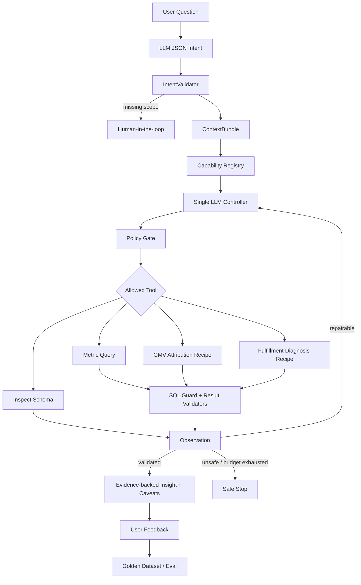

# Olist Growth Copilot

> 一个面向电商增长分析的可信 Data Agent：把自然语言问题转化为可审计的分析运行，并通过指标语义、确定性校验、Golden Set 与可选 LangSmith Trace 建立“验算闭环”。

**技术栈**：Streamlit · LangGraph · DuckDB · OpenAI-compatible LLM API · Python 3.11 · LangSmith（可选）

## 产品定位

普通 NL2SQL Demo 通常只回答“SQL 能不能跑”。Growth Copilot 进一步记录和验证：

```text
用户问题
  ↓
LLM JSON Output：任务、指标、时间、粒度、维度、歧义
  ↓
IntentValidator：语义层约束、参数校验与必要澄清
  ↓
ContextBundle：指标、Schema、Join 规则与输出契约
  ↓
Capability Registry：只暴露当前问题相关的分析能力
  ↓
单一 Agent Controller：在允许动作中选择下一步
  ↓
Policy Gate：动作白名单、能力边界与步数预算
  ↓
LangGraph Loop：Query / Inspect Schema / GMV Recipe / Fulfillment Recipe
  ↓
确定性 Validator → observation → 继续 / 结束 / 安全停止
  ↓
洞察与限制 → 用户反馈 → Golden Dataset → 回归评测
```

产品采用“受控自主”边界：一个模型 Controller 可以根据意图与执行观察选择下一步工具，但不能绕过 Capability Registry、Policy Gate、SQL Guard、步数预算和结果校验。成熟商业分析方法被封装为可验算的 Recipe，而不是交给模型自由猜测。

## 当前能力

| 能力 | 当前实现 |
| --- | --- |
| 结构化意图 | LLM JSON Output 解析候选意图；确定性 `IntentValidator` 校验指标、参数和必要澄清 |
| 单一 Agent Controller | `CapabilityRegistry` 先筛选相关能力；LLM 从当前允许动作中选择一步，`Policy Gate` 拒绝越界动作并回退到安全政策 |
| LangGraph 有界循环 | 根据 execution/validation observation 决定结束、补 Schema、修复查询或安全停止 |
| Human-in-the-loop | 模糊指标请求主动澄清；超出当前归因边界时先确认 |
| 统一 AnalysisRun | 每次运行记录 `run_id`、能力提示、Agent 决策、Policy 状态、SQL、验证、版本、延迟与失败阶段 |
| Text-to-SQL | DeepSeek、OpenAI 或 OpenAI-compatible API；SQL 仍需通过确定性 Guard、执行与结果校验 |
| SQL Guardrail | 只读、单语句、危险关键字拦截、表白名单、自动 LIMIT |
| 指标语义层 | `metrics.yml` 定义 28 个增长、订单、用户、履约和评价指标 |
| GMV 归因 Recipe | `GMV = Orders × AOV`，并按州、品类、商家下钻变化贡献 |
| 履约诊断 Recipe | 将准时送达率变化精确拆为客户州结构效应与组内履约效应，并按州下钻 |
| 确定性验算器 | 非空、输出契约、比例/窗口、GMV 分解、履约 mix/within 与州贡献可加和 |
| 有限纠错 | LLM SQL 被 Guard、执行或结果校验拒绝时，最多携带确定性错误重试一次 |
| 可观测性 | 可选 LangSmith Trace；缺依赖、缺 Key 或发送失败均不阻塞主分析 |
| 反馈闭环 | UI 收集有用性与失败类型，本地写入 `.runtime/feedback.jsonl` |
| Eval v3 | 40 道 SQL 全结果等价 + 8 道意图 + 12 道动作轨迹 + 分层失败与统一分母 |

## 可信分析界面

每次回答由以下区域构成：

1. **分析计划与口径**：系统理解的任务、指标、时间范围、能力提示与假设。
2. **数据与洞察**：SQL、查询结果、图表或可验算的分析 Recipe。
3. **确定性校验**：逐项显示通过或失败，不展示模型隐藏思维链。
4. **运行元数据**：模型、Prompt/指标版本、延迟、重试、Trace 状态。
5. **用户反馈**：将负反馈沉淀为后续 Golden Set 候选。

推荐演示问题：

- `近30天GMV走势（按天）`：正常指标查询与结果校验。
- `为什么最近GMV下降？`：默认最近 30 天，执行确定性归因。
- `为什么最近准时送达率下降？`：执行履约 mix/within 分解与客户州贡献下钻。
- `最近销售表现怎么样？`：缺少指标，主动澄清。


## 架构



核心模块：

```text
growth-analysis-agent/
├── app.py                         # Streamlit 产品界面，仅负责配置与展示
├── agent/
│   ├── models.py                  # AnalysisIntent / AnalysisRun / ValidationResult
│   ├── pipeline.py                # 统一分析编排入口 execute_analysis()
│   ├── intent_router.py           # LLM structured intent 解析
│   ├── intent_validator.py        # 指标、参数、能力边界与澄清政策
│   ├── capabilities.py            # 用户能力合同与相关动作筛选
│   ├── planner.py                 # 单一 LLM Controller / Tool Registry / Policy Gate
│   ├── agent_loop.py              # 步数预算与安全回退 Controller
│   ├── langgraph_runtime.py       # 条件边与 observation 循环
│   ├── context_builder.py         # 指标、Schema、Join 和输出契约
│   ├── validators.py              # 查询、GMV 与履约诊断确定性校验
│   ├── observability.py           # 可选 LangSmith adapter
│   ├── feedback.py                # 本地 JSONL 反馈存储
│   ├── llm_sql.py                 # Text-to-SQL 与有限重试反馈
│   ├── sql_guard.py               # SQL 安全校验
│   ├── metrics_store.py           # 指标语义读取与版本
│   ├── attribution.py             # GMV 确定性归因
│   ├── fulfillment.py             # 履约结构/组内分解 Recipe
│   └── insight.py                 # 查询结果摘要
├── metrics/metrics.yml            # 28 个指标定义
├── eval/
│   ├── questions.jsonl            # 40 道 Golden SQL
│   ├── intent_cases.jsonl          # 8 道意图/澄清 Golden Case
│   ├── trajectory_cases.jsonl      # 12 道动作轨迹 Golden Case
│   ├── run_eval.py                # SQL、结果、合规、E2E 评测
│   ├── run_intent_eval.py         # 路由与澄清评测
│   ├── run_trajectory_eval.py     # Planner / Policy 轨迹评测
│   └── langsmith_experiment.py    # 可选 Dataset 上传与 Experiment
├── tests/                          # 无网络单元/集成测试
└── warehouse/                     # Olist → DuckDB 与分析视图
```

## 快速开始

### 1. 安装

```bash
python3 -m venv .venv
source .venv/bin/activate
pip install -r requirements.txt
```

### 2. 准备数据

仓库 Demo 使用 Olist 数据。若本地没有 `olist.duckdb`，把原始 CSV 放入 `olist_data/` 后运行：

```bash
python warehouse/load_olist_to_duckdb.py
```

生成的核心视图：

| 视图 | 用途 |
| --- | --- |
| `vw_eligible_orders` | 有效支付类订单 |
| `vw_fact_items` | GMV、用户、州、商品、商家明细 |
| `vw_delivered_orders` | 履约与配送分析 |

### 3. 配置模型

```bash
cp .env.example .env
```

默认配置 DeepSeek：

```dotenv
DEEPSEEK_API_KEY=your-key
DEEPSEEK_MODEL=deepseek-chat
DEEPSEEK_BASE_URL=https://api.deepseek.com/v1
```

也可以设置 `LLM_PROVIDER=openai`，并配置 `OPENAI_API_KEY`、`OPENAI_MODEL` 和 `OPENAI_BASE_URL`；自定义 OpenAI-compatible 服务使用对应的 `OPENAI_COMPATIBLE_*` 配置。未配置所选服务的 Key、模型调用失败或输出无法通过本地 schema 校验时，系统明确失败；不会回退到关键词意图路由。

公开部署时，访客可以在左侧栏选择 DeepSeek、OpenAI 或 OpenAI-compatible 服务，并输入自己的 Key。会话配置：

- 只保存在当前 Streamlit 会话的服务器内存中，不写入项目文件、反馈或 `AnalysisRun`；
- 显式传递给意图识别、Agent Controller 与 Text-to-SQL，不通过进程级环境变量共享；
- 请求由部署服务器转发给用户选择的模型服务；公开 UI 强制使用访客会话 Key，不读取部署环境中的模型 Key；
- 自定义兼容服务必须使用公开 HTTPS 地址，明显的本机、私网和保留地址会被拒绝。

### 4. 启动

```bash
streamlit run app.py
```

## LangSmith Trace（可选）

主应用不依赖 LangSmith。需要 Trace 时安装：

```bash
pip install -r requirements-observability.txt
```

配置：

```dotenv
LANGSMITH_TRACING=true
LANGSMITH_API_KEY=your-langsmith-key
LANGSMITH_PROJECT=growth-analysis-agent
```

Trace 树按业务步骤组织，而不只是记录单次模型调用：

```text
growth_analysis_run
├── parse_intent
├── assemble_context
├── select_next_action              # 单一 Controller 的结构化决策
├── calculate_gmv_attribution        # GMV Recipe
├── calculate_fulfillment_diagnosis  # 履约 Recipe
└── generate_sql                     # Query Tool
    ├── validate_sql
    ├── execute_duckdb
    ├── validate_result
    └── generate_insight
```

每条 Trace 附带能力提示、动作与决策来源、模型、Prompt/指标版本、尝试次数、延迟、校验和失败阶段。Trace 发送异常被隔离，不会影响用户查询。

## AI Evals

本项目只引用带日期、模型和分母的评测快照。最新可公开结果及原始 JSON 见 [`eval/results/`](eval/results/README.md)；历史条件化指标不作为当前端到端质量结论。

### 评测原则

| 层次 | 评测对象 |
| --- | --- |
| Intent | 指标、能力提示、时间、维度、粒度、是否应该澄清 |
| Trajectory | 工具选择、动作顺序、错误恢复、停止条件与步数预算 |
| Pipeline | 生成、Guard、执行是否成功 |
| Result | 列集合、行集合、每个数值、分组键、排序/Top N、时间结果 |
| Compliance | 是否使用正确表、字段与指标关键模式 |
| End-to-end | 以全部题目为统一分母；执行失败同样计为语义失败 |

当前 40 道 SQL 题采用完整结果等价或严格行数 + 结果等价检查；轨迹质量由独立的 12 道 trajectory Case 评估。

单元测试用固定 structured payload 验证解析契约、`IntentValidator`、Planner Policy、LangGraph 轨迹、SQL Guard、两类 Recipe 和结果校验，不调用远程模型。最后一条只验证 SQL 评测管道的有限规则路径；它不是 LLM 质量报告，也不能替代真实模型评测。

### 真实模型评测

```bash
PYTHONPATH=. python eval/run_intent_eval.py --output .runtime/intent-eval.json
PYTHONPATH=. python eval/run_trajectory_eval.py --use-llm --output .runtime/trajectory-eval.json
PYTHONPATH=. python eval/run_eval.py --use-llm --output .runtime/model-eval.json
```

输出同时包含：

- SQL 生成、Guard、执行成功率
- 以 40 道 Golden Case 为分母的结果正确率
- 指标合规率
- 端到端任务成功率
- 按难度和业务类别拆分的失败清单
- `sql_source_counts`，用于确认本次结果来自真实 LLM 还是 fallback

`run_intent_eval.py` 强制要求 `DEEPSEEK_API_KEY`，并记录 provider、model、structured parsing/validation 失败和各字段匹配结果；不存在无 Key 的关键词路由成绩。


## LangSmith Dataset 与 Experiment（可选）

先预览将上传的数据：

```bash
PYTHONPATH=. python eval/langsmith_experiment.py --preview
```

上传 40 道 Golden Case：

```bash
PYTHONPATH=. python eval/langsmith_experiment.py --upload-dataset
```

运行离线 Experiment：

```bash
PYTHONPATH=. python eval/langsmith_experiment.py \
  --run-experiment \
  --experiment-prefix growth-agent-v2
```

内置三类 LangSmith Evaluator：

- `result_correctness`：本地执行 Golden SQL，比较完整结果。
- `metric_compliance`：检查正确表与关键指标模式。
- `pipeline_success`：检查 AnalysisRun 和确定性校验是否成功。

## 反馈闭环

应用把反馈写入 `.runtime/feedback.jsonl`：

```text
run_id + 问题 + 能力提示 + 有用性 + 失败类型 + 用户说明
```

建议人工审核负反馈后再加入 Golden Dataset，避免把误操作或无效反馈直接当成标准答案。

## Statsig 的边界

仓库保留一个独立 Statsig 示例：

- [接入说明](docs/statsig_llm_agent.md)
- [Python 示例](examples/statsig_agent_example.py)

当前分工：

- **LangSmith**：Trace、失败诊断、Dataset、离线 Experiment。
- **Statsig**：未来存在两个可灰度版本时，用于 Feature Gate、实验分流和产品采用率。

Statsig 暂未接入主 Pipeline，避免在没有真实分流需求时重复建设观测链路。

## 当前边界

- 确定性诊断目前支持 GMV 与准时送达率；履约贡献解释不等于因果推断。
- Planner 只能选择白名单工具；关键结束条件仍由确定性 Policy 与 Validator 控制。
- LangSmith Cloud Experiment 需要用户自行配置账号与 API Key，本地不会自动上传数据。
- 尚未实现角色级行列权限、PII 脱敏、任意工具开放式 Agent、因果推断和通用 Dashboard。
- LLM 输出叙事不能自证正确；关键数字和归因必须先通过代码校验。
