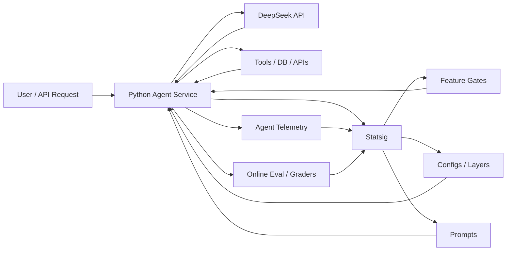

# Statsig + LLM Agent 架构图与接入说明

这个示例把 Statsig 放在 Agent 的控制面上，用来做四件事：

1. 用 `feature gate` 控制 AI 功能是否放量
2. 用 `dynamic config` / `prompt` 控制模型、prompt、参数
3. 用 `event` 记录成本、时延、采纳率、错误
4. 用 `online eval` 把评分结果回传到 Statsig

## 架构图



## 一个典型请求怎么走

1. 请求进入 Python Agent 服务
2. Agent 用 `StatsigUser` 做用户分流
3. `check_gate()` 判断这个用户是否允许进入新 Agent 能力
4. `get_dynamic_config()` 或 `get_layer()` 读取模型、温度、是否允许工具调用、最大工具步数
5. `get_prompt()` 读取当前 live prompt 版本
6. Agent 调用 LLM 和工具
7. 用 `log_event()` 记录 token 成本、时延、任务是否成功、用户是否采纳
8. 用 `log_eval_grade()` 记录在线评分结果
9. 在 Statsig 里看 rollout、实验、质量和成本表现

## 推荐的 Statsig 实体划分

| 场景 | 推荐实体 | 用法 |
| --- | --- | --- |
| 新 agent 能力灰度上线 | Feature Gate | 只给内部用户或 5% 流量开放 |
| 模型名、温度、工具步数 | Dynamic Config / Layer | 做参数化和实验分流 |
| prompt 文案和模型配置 | Prompt | 在控制台直接迭代 prompt，不改代码 |
| 成功率、采纳率、错误率 | Event | 监控线上表现 |
| 回答质量、格式合规、安全性 | Online Eval | 记录 grader 分数 |

## 最小落地建议

如果你们是第一次把 Statsig 接进 Agent，建议按这个顺序来：

1. 先上 `feature gate`，确保能力可开可关
2. 再上 `dynamic config`，把模型和参数外置
3. 再上 `prompt management`，把 prompt 版本化
4. 最后补 `event` 和 `online eval`，把效果闭环补齐

## Python 示例

可参考：

- [examples/statsig_agent_example.py](../examples/statsig_agent_example.py)

## 安装依赖

这个仓库当前没有把 Statsig 依赖加入主 `requirements.txt`，因为它是可选示例。你可以单独安装：

```bash
pip install statsig-python-core statsig-ai
```

然后设置：

```bash
export STATSIG_SERVER_SECRET_KEY="your-server-secret-key"
export DEEPSEEK_API_KEY="your-deepseek-api-key"
```

## 设计提醒

- Server Secret Key 只放服务端
- 在 WSGI / Gunicorn / uWSGI 场景里，按官方建议在 worker fork 之后初始化 Statsig
- 如果你的 Agent 有高风险动作，建议把“发邮件 / 写库 / 调生产 API”都挂在单独 gate 后面
- 采纳率、重试率、人工接管率，通常比“模型看起来很聪明”更值得盯
